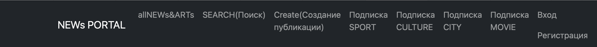
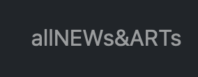
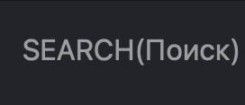
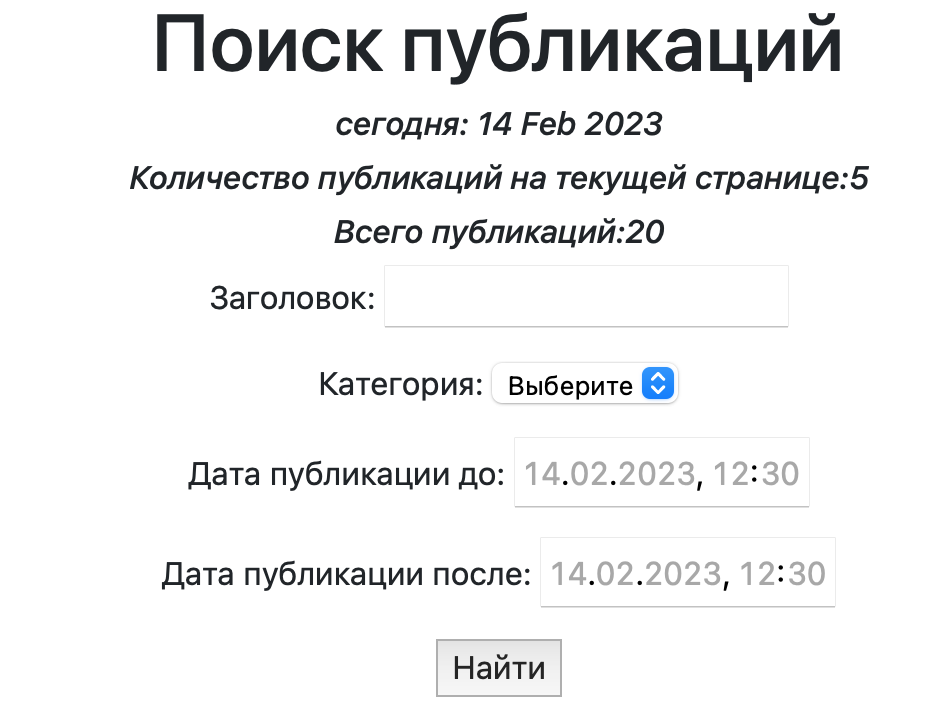
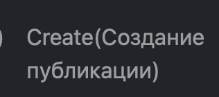
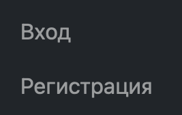
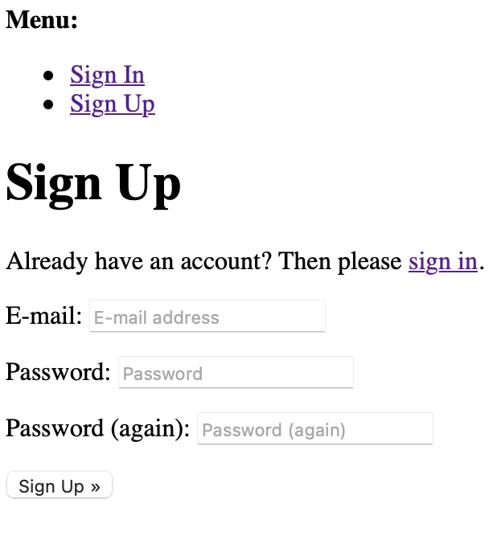
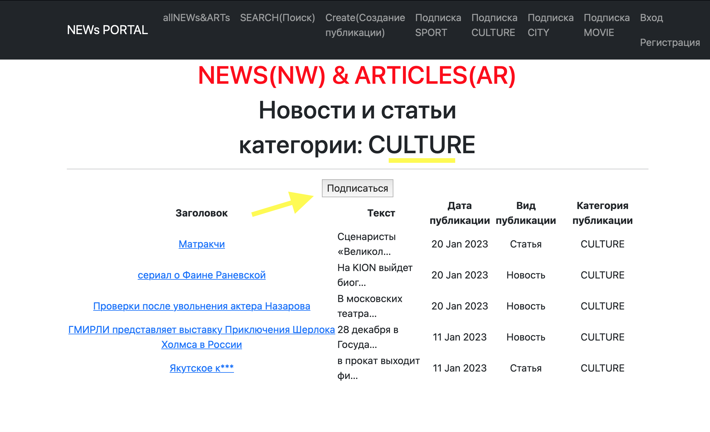

Hi, I'm **Alina** 👋

I 'm trying to become a developer . I'm trying to get into IT. 
It is a difficult path for me. But I'm not discouraged because **everything is possible** 🤞😉

My main project is [NEWsPortal](http://127.0.0.1:8003/news/) at the moment.
Let me tell you about this project


# [NEWsPortal](http://127.0.0.1:8003/news/)
### [)](https://git.io/typing-svg)

---
Project developed by:


Site structure:


I'll tell you more about the navigation buttons:

1. 
   
    Click on this button and you will see list of news and articles. Sorting by date
2. 

   You can find news by date, title, category.
   Look here:
   


3. 
   
   You can create your own news or articles! 🎉
   but it's available for only registered users.

   For Sing up you should press button:

   

   Complete this form:

   

   or if you are a registered user press [Sign IN](http://127.0.0.1:8003/accounts/login/)


4. 

   Уou can quickly subscribe to the categories of news and articles which you like by clicking on these buttons. 
   The buttons shared into categories.
   
   For example:

   

---
## 🔧Technical instructions🔩 
### Celery 

Easy install celery:

```` (virtualenv) $ pip3 install celery ````

Create ```` celery.py: ````

```
import os
from celery import Celery
from celery.schedules import crontab

os.environ.setdefault('DJANGO_SETTINGS_MODULE', 'project.settings')

app = Celery('project')
app.config_from_object('django.conf:settings', namespace='CELERY')

app.autodiscover_tasks()

app.conf.beat_schedule = {
   'nameforlogs': {
      'tasks': 'nameproject.tasks.func',
      'schedule': crontab=(period),
   },
}
```

Add to ```` __init__.py: ````

````
from .celery import app as celery_app

__all__ = ('celery_app',) 
````

Create```` tasks.py ````

````
from celery import shared_task

def func()
...
````

Start Celery
``` 
(virtualenv) $ celery -A proj_name worker -l INFO 
```

For schedule:

````
celery -A mcdonalds worker -l INFO -B
````


### Redis 

Click here ➡️  [Installation instructions Redis on macOS](https://redis.io/docs/getting-started/installation/install-redis-on-mac-os/)

Add to ``` settings.py: ```

````
CELERY_BROKER_URL = 'redis://localhost:6379'
CELERY_RESULT_BACKEND = 'redis://localhost:6379'
CELERY_ACCEPT_CONTENT = ['application/json']
CELERY_TASK_SERIALIZER = 'json'
CELERY_RESULT_SERIALIZER = 'json'
````

CACHE 
Click here ➡️  [Django doc CACHE](https://djangodoc.ru/3.1/topics/cache/?ysclid=le85qfqnzb864791767)

Add to ``` settings.py: ```

````
CACHES = {
    'default': {
        'TIMEOUT': 60,
        'BACKEND': 'django.core.cache.backends.filebased.FileBasedCache',
        'LOCATION': os.path.join(BASE_DIR, 'cache_files'),
    }
}
````
Add to ``` views.py: ```

````
class PostDetail(DetailView):
...
    def get_object(self, *args, **kwargs):
        obj = cache.get(f'post-{self.kwargs["pk"]}', None)
        print('cache.get obj', obj)
        if not obj:
            obj = super().get_object(queryset=self.queryset)
            cache.set(f'post-{self.kwargs["pk"]}', obj)
            print('if not obj', obj)
        return obj
````       
 

Add to ``` models.py: ```

````
class Post(models.Model):
...
    def save(self, *args, **kwargs):
        super().save(*args, **kwargs)
        cache.delete(f'news-{self.pk}')
````

## ~~Don't use print~~ 
## LOGGING

Add to ``` settings.py: ```

````
LOGGING = {
    'version': 1,
    'disable_existing_loggers': False,
    'formatters': {
        'baseform': {
            'format': '{asctime} {levelname} {message}',
            'style': '{',
        },
        ...
    'filters': {
        'require_debug_true': {
            '()': 'django.utils.log.RequireDebugTrue',
        },
        'require_debug_false': {
            '()': 'django.utils.log.RequireDebugFalse',
        },
    },
    ...
    'handlers': {
        'console': {
            'level': 'DEBUG',
            'filters': ['require_debug_true'],
            'class': 'logging.StreamHandler',
            'formatter': 'baseform',
       ....
        'security': {
            'level': 'INFO',
            'class': 'logging.FileHandler',
            'filename': 'security.log',
            'formatter': 'generalseclogform',
        },
        'mail_admins': {
            'level': 'ERROR',
            'filters': ['require_debug_false']
            'class': 'django.utils.log.AdminEmailHandler',
            'formatter': 'errorlogform2'
        },
         
    },
    ....
    
    'loggers': {
        'django': {
            'handlers': ['console', 'consoleWar', 'consoleEC', 'general'],

        },
        ....
}

ADMINS = [('name', 'name@host.com')]
````
---

So it's the main functionality of my project at the moment. 
I'm going to refine and improve this project.

```` Thank you! 🙏 ````

___


[](https://github.com/anuraghazra/github-readme-stats)